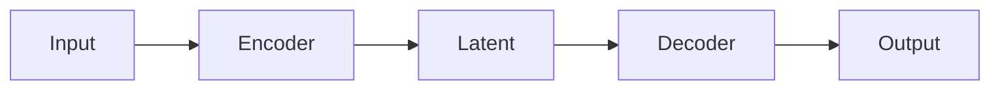
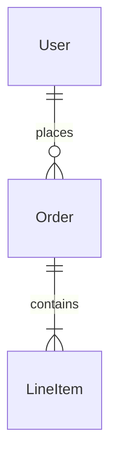

# System Design & Architecture

## Architecture Overview
**What is the high-level system structure?**

- Include a mermaid diagram that captures the main components and their relationships. Example:
  ```mermaid
  graph TD
    Client -->|HTTPS| API
    API --> ServiceA
    API --> ServiceB
    ServiceA --> Database[(DB)]
  ```
- Key components and their responsibilities
- Technology stack choices and rationale

## Data Models
**What data do we need to manage?**

- Core entities and their relationships
- Data schemas/structures
- Data flow between components

## API Design
**How do components communicate?**

- External APIs (if applicable)
- Internal interfaces
- Request/response formats
- Authentication/authorization approach

## Component Breakdown
**What are the major building blocks?**

- Frontend components (if applicable)
- Backend services/modules
- Database/storage layer
- Third-party integrations

## Design Decisions
**Why did we choose this approach?**

- Key architectural decisions and trade-offs
- Alternatives considered
- Patterns and principles applied

## Non-Functional Requirements
**How should the system perform?**

- Performance targets
- Scalability considerations
- Security requirements
- Reliability/availability needs

---

## 🤖 Model Architecture (AI/ML Projects)
**What is the neural network/model structure?**



- Model type: (e.g., Transformer, CNN, RNN, MAE)
- Key hyperparameters (layers, dimensions, heads)
- Training strategy (pretrain, finetune)
- Expected model size and inference time

## 🗄️ Database Schema (Backend Projects)
**What is the data structure?**



- Tables/collections and relationships
- Indexes for query optimization
- Migration strategy

## 🧩 Component Tree (Web Projects)
**What is the frontend structure?**

```
src/
├── components/
│   ├── common/          # Reusable UI components
│   ├── features/        # Feature-specific components
│   └── layouts/         # Page layouts
├── pages/               # Route pages
├── hooks/               # Custom hooks
└── utils/               # Helper functions
```

- State management approach
- Routing structure
- Key reusable components
