# System Design & Architecture

## Architecture Overview

**Cấu trúc tổng thể của MAE system**

```mermaid
graph TD
    subgraph "Input"
        IMG["Image (B,3,224,224)"]
    end

    subgraph "mae/ — Core Modules"
        PE[PatchEmbed]
        POS[Positional Embedding]
        MASK[Random Masking]
        ENC[MAEEncoder]
        DEC[MAEDecoder]
        ATT[Attention]
        TF[Transformer Block]
        MLP[MLP]
    end

    subgraph "models/ — Model Variants"
        BASE["MAEViTBase\n(768d, 12 blocks)"]
        LARGE["MAEViTLarge\n(1024d, 24 blocks)"]
        HUGE["MAEViTHuge\n(1280d, 32 blocks)"]
        REG["Model Registry\n& Factory Functions"]
    end

    subgraph "Output"
        LOSS["Loss (scalar)"]
        PRED["Pred (B, L, p²×3)"]
        MASKO["Mask (B, L)"]
    end

    IMG --> PE --> POS --> MASK --> ENC --> DEC
    ENC --> |latent| DEC
    DEC --> LOSS & PRED & MASKO

    ATT --> TF
    MLP --> TF
    TF --> ENC
    TF --> DEC

    ENC & DEC --> BASE & LARGE & HUGE
    BASE & LARGE & HUGE --> REG
```



### Key Components

| Component              | File                 | Responsibility                                                          |
| ---------------------- | -------------------- | ----------------------------------------------------------------------- |
| `PatchEmbed`           | `mae/patch_embed.py` | Conv2d projection: image → patch tokens                                 |
| `Positional Embedding` | `mae/pos_embed.py`   | 2D sinusoidal positional encoding                                       |
| `Random Masking`       | `mae/masking.py`     | Per-sample random masking (75% default)                                 |
| `Attention`            | `mae/attention.py`   | Multi-head self-attention                                               |
| `Block` (Transformer)  | `mae/transformer.py` | Pre-norm transformer block (LN → Attn → Residual → LN → MLP → Residual) |
| `MAEEncoder`           | `mae/encoder.py`     | Encode visible patches only (no mask tokens)                            |
| `MAEDecoder`           | `mae/decoder.py`     | Decode full sequence with mask tokens                                   |
| `MAE`                  | `mae/mae.py`         | Full model glue: encoder + decoder + loss                               |
| Model variants         | `models/*.py`        | Specific configs for Base/Large/Huge                                    |

### Technology Stack

- **Framework**: PyTorch (≥1.8)
- **No external model deps**: All modules implemented from scratch (no `timm` dependency)
- **Reference**: `official_mae/models_mae.py` for verification only

## Data Flow (MAE Pipeline)

```mermaid
graph LR
    A["Image\n(B,3,H,W)"] -->|PatchEmbed| B["Patches\n(B,L,D)"]
    B -->|"+pos_embed"| C["Patches+Pos\n(B,L,D)"]
    C -->|"Random Masking\n75%"| D["Visible\n(B,L×0.25,D)"]
    D -->|"+CLS token"| E["Encoder Input\n(B,L×0.25+1,D)"]
    E -->|"N×Block"| F["Latent\n(B,L×0.25+1,D)"]
    F -->|"Linear proj"| G["Decoder tokens\n(B,L×0.25+1,d)"]
    G -->|"+mask_tokens\n+unshuffle\n+pos_embed"| H["Full Sequence\n(B,L+1,d)"]
    H -->|"M×Block"| I["Decoded\n(B,L+1,d)"]
    I -->|"Linear pred\nRemove CLS"| J["Prediction\n(B,L,p²×3)"]
    J -->|"MSE on masked"| K["Loss"]
```



## Component Breakdown — Module Design

### 1. `mae/encoder.py` — MAEEncoder

```python
class MAEEncoder(nn.Module):
    """
    MAE Encoder: operates ONLY on visible patches.

    Paper Section 3.2: "Our encoder is a ViT but applied only on
    visible, unmasked patches."

    Key design: No mask tokens in encoder → saves compute + avoids
    distribution mismatch between pre-training and fine-tuning.
    """
    def __init__(self, embed_dim, depth, num_heads, mlp_ratio=4.0):
        ...

    def forward(self, x):
        """Input: visible patches (B, L_vis+1, D) — already has CLS token.
           Output: encoded latent (B, L_vis+1, D)"""
        for blk in self.blocks:
            x = blk(x)
        return self.norm(x)
```

### 2. `mae/decoder.py` — MAEDecoder

```python
class MAEDecoder(nn.Module):
    """
    MAE Decoder: lightweight, reconstructs full image from latent + mask tokens.

    Paper Section 3.3: "The MAE decoder is only used during pre-training...
    the decoder design is independent of the encoder design."

    Key design:
    - Lighter than encoder (512-dim, 8 blocks vs encoder's deeper config)
    - Insert learnable mask tokens at masked positions
    - Unshuffle to restore original patch order
    """
    def __init__(self, encoder_embed_dim, decoder_embed_dim, num_patches,
                 patch_size, in_chans, depth, num_heads, mlp_ratio=4.0):
        ...

    def forward(self, x, ids_restore):
        """Input: encoder latent (B, L_vis+1, D_enc)
           Output: pixel predictions (B, L, p²×3)"""
        ...
```

### 3. `models/` — Model Variant Folder

```
models/
├── __init__.py          # Exports: mae_vit_base_patch16, mae_vit_large_patch16, mae_vit_huge_patch14
├── README.md            # Comparison table, usage examples, paper mapping
├── mae_vit_base.py      # ViT-Base config + class
├── mae_vit_large.py     # ViT-Large config + class
└── mae_vit_huge.py      # ViT-Huge config + class
```

### 4. `mae/mae.py` — Refactored MAE (Unified)

Refactor hiện tại để compose `MAEEncoder` + `MAEDecoder`:

```python
class MaskedAutoencoder(nn.Module):
    """Full MAE model composing Encoder + Decoder."""
    def __init__(self, img_size, patch_size, in_chans,
                 embed_dim, depth, num_heads,
                 decoder_embed_dim, decoder_depth, decoder_num_heads,
                 mlp_ratio=4.0, norm_pix_loss=False):
        ...
        self.encoder = MAEEncoder(embed_dim, depth, num_heads, mlp_ratio)
        self.decoder = MAEDecoder(embed_dim, decoder_embed_dim, ...)
```

## Design Decisions

**Why did we choose this approach?**

| Decision                             | Choice         | Rationale                                                                           |
| ------------------------------------ | -------------- | ----------------------------------------------------------------------------------- |
| Separate `encoder.py` / `decoder.py` | Yes            | Paper emphasizes asymmetric design; lets users study each independently             |
| Keep `mae.py` as unified glue        | Yes            | Users need a single entry point for end-to-end forward                              |
| New `models/` folder                 | Yes            | Clean separation: `mae/` = reusable modules, `models/` = specific configs           |
| Factory functions (snake_case)       | Yes            | Matches official MAE convention (`mae_vit_base_patch16_dec512d8b`)                  |
| No `timm` dependency                 | Keep           | Educational purpose — understand every layer                                        |
| `norm_layer` parameter               | Add to `Block` | Official uses `partial(nn.LayerNorm, eps=1e-6)`, our Block hardcodes `nn.LayerNorm` |

## Non-Functional Requirements

### Performance

- ViT-Base forward pass: < 50ms on GPU (batch=1)
- ViT-Huge: Can instantiate on CPU for testing (no GPU required for unit tests)

### Code Quality

- Every module has docstring referencing paper section
- Type hints on all public APIs
- Comments in Vietnamese for educational clarity

---

## 🤖 Model Architecture (AI/ML Projects)

**Neural network structure from paper**

```mermaid
graph LR
    subgraph Encoder["Encoder (ViT)"]
        direction TB
        E1[PatchEmbed] --> E2["+Pos Embed"]
        E2 --> E3["Random Masking 75%"]
        E3 --> E4["+CLS Token"]
        E4 --> E5["N × Transformer Blocks"]
        E5 --> E6[LayerNorm]
    end

    subgraph Decoder["Decoder (Lightweight)"]
        direction TB
        D1["Linear Projection"] --> D2["+Mask Tokens"]
        D2 --> D3["Unshuffle"]
        D3 --> D4["+Pos Embed"]
        D4 --> D5["M × Transformer Blocks"]
        D5 --> D6[LayerNorm]
        D6 --> D7["Linear → pixels"]
    end

    Encoder --> Decoder
```



### Model Hyperparameters (from Paper Table 1)

| Hyperparameter      | ViT-Base/16 | ViT-Large/16 | ViT-Huge/14 |
| ------------------- | ----------- | ------------ | ----------- |
| Encoder `embed_dim` | 768         | 1024         | 1280        |
| Encoder `depth`     | 12          | 24           | 32          |
| Encoder `num_heads` | 12          | 16           | 16          |
| Decoder `embed_dim` | 512         | 512          | 512         |
| Decoder `depth`     | 8           | 8            | 8           |
| Decoder `num_heads` | 16          | 16           | 16          |
| `patch_size`        | 16          | 16           | 14          |
| `num_patches`       | 196         | 196          | 256         |
| `mlp_ratio`         | 4.0         | 4.0          | 4.0         |
| Mask ratio          | 75%         | 75%          | 75%         |
| `norm_pix_loss`     | True        | True         | True        |

### Key Architecture Insights (Paper)

1. **Asymmetric design** (Section 3): Encoder is large, decoder is lightweight → encoder doesn't waste compute on mask tokens
2. **No mask tokens in encoder** (Section 3.2): Avoids gap between pre-training (with masks) and fine-tuning (no masks)
3. **High mask ratio** (Section 4.3): 75% optimal — creates meaningful reconstruction task
4. **Decoder is disposable** (Section 3.3): Only used during pre-training, discarded for downstream
5. **Per-patch normalized pixels** as target (Section 3.4): `norm_pix_loss=True` improves representation quality
