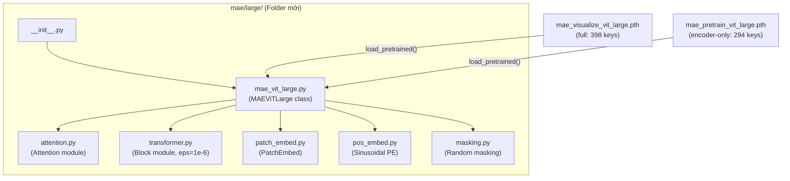
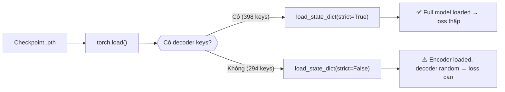

# Thiết kế hệ thống & Kiến trúc

## Tổng quan kiến trúc



## Cấu trúc folder

```
mae/
├── large/
│   ├── __init__.py
│   ├── mae_vit_large.py         # Class MAEViTLarge (load_pretrained tự detect)
│   ├── attention.py             # Multi-head Attention (qkv_bias=True)
│   ├── transformer.py           # Block (Pre-norm, LayerNorm eps=1e-6)
│   ├── patch_embed.py
│   ├── pos_embed.py
│   └── masking.py
```

## Flow load trọng số



## Hai loại checkpoint từ Facebook

| File                          | Keys          | URL                  | Mục đích       |
| ----------------------------- | ------------- | -------------------- | -------------- |
| `mae_visualize_vit_large.pth` | 398 (full)    | `.../mae/visualize/` | Reconstruction |
| `mae_pretrain_vit_large.pth`  | 294 (encoder) | `.../mae/pretrain/`  | Fine-tuning    |

## Kiến trúc ViT-Large

| Tham số             | Giá trị  |
| ------------------- | -------- |
| `embed_dim`         | 1024     |
| `depth`             | 24       |
| `num_heads`         | 16       |
| `patch_size`        | 16       |
| `mlp_ratio`         | 4.0      |
| `decoder_embed_dim` | 512      |
| `decoder_depth`     | 8        |
| `decoder_num_heads` | 16       |
| **LayerNorm eps**   | **1e-6** |
| Tổng params (full)  | ~330M    |

## Quyết định thiết kế

1. **`load_pretrained()` tự detect:** Phát hiện full vs encoder-only, strict/non-strict tương ứng
2. **LayerNorm eps=1e-6:** Khớp official `partial(nn.LayerNorm, eps=1e-6)`
3. **Block nhận `norm_layer`:** Flexible, default `nn.LayerNorm(dim, eps=1e-6)`
4. **Backward compatibility:** `load_pretrained_encoder()` = alias cho `load_pretrained()`
