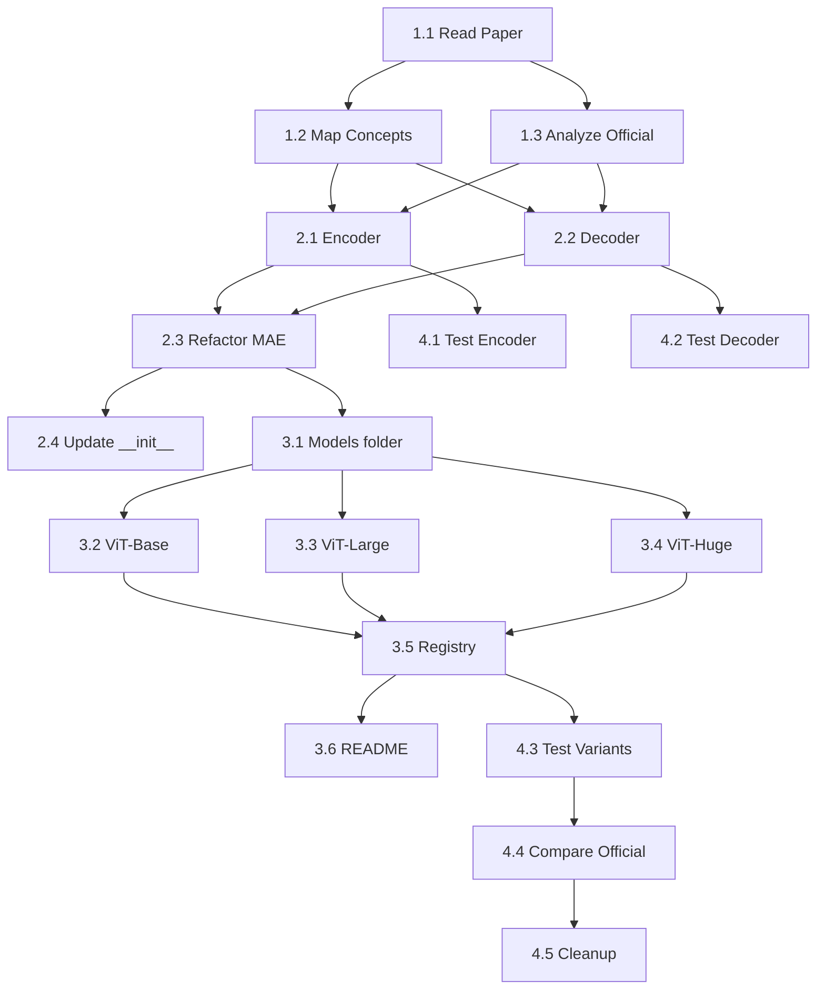

# Project Planning & Task Breakdown

## Milestones

**What are the major checkpoints?**

- [ ] **Milestone 1**: Core modules hoàn thiện (Encoder, Decoder tách riêng)
- [ ] **Milestone 2**: Tất cả 3 model variants (Base, Large, Huge) hoạt động
- [ ] **Milestone 3**: Models folder với documentation + verification vs official
- [ ] **Milestone 4**: Tests pass + output matches official implementation

## Task Breakdown

**What specific work needs to be done?**

### Phase 1: Hiểu Model — Paper Analysis

> Mục tiêu: Nắm vững kiến trúc trước khi code

- [ ] **Task 1.1**: Đọc & annotate Paper Sections 3-4
  - Section 3.1: Masking strategy (random, 75%)
  - Section 3.2: MAE Encoder (ViT on visible patches only)
  - Section 3.3: MAE Decoder (lightweight, reconstruct full image)
  - Section 3.4: Reconstruction target (per-patch normalized pixels)
  - Section 4.3: Ablation on mask ratio
  - Section 4.4: Ablation on decoder design

- [ ] **Task 1.2**: Map paper concepts → code modules
  - Tạo bảng mapping: Paper equation/concept → file/class/method
  - Verify existing modules (`patch_embed.py`, `masking.py`, `pos_embed.py`, `attention.py`, `transformer.py`) đã đúng chưa

- [ ] **Task 1.3**: Phân tích official implementation (`official_mae/models_mae.py`)
  - Xác định mọi khác biệt giữa code hiện tại và official
  - Ghi nhận: qkv_bias, norm_layer, weight init, PatchEmbed proj init

### Phase 2: Tách Module — Encoder & Decoder

> Mục tiêu: encoder.py và decoder.py là các module độc lập

- [ ] **Task 2.1**: Implement `mae/encoder.py` — MAEEncoder
  - Extract encoder logic từ `mae/mae.py` thành class riêng
  - Bao gồm: transformer blocks + final LayerNorm
  - API: `forward(x) → x` (nhận visible patches + CLS, trả latent)
  - Docstring tham chiếu Paper Section 3.2

- [ ] **Task 2.2**: Implement `mae/decoder.py` — MAEDecoder
  - Extract decoder logic từ `mae/mae.py`
  - Bao gồm: linear projection, mask token, pos embed, blocks, pred head
  - API: `forward(x, ids_restore) → pred` (nhận latent, trả pixel predictions)
  - Docstring tham chiếu Paper Section 3.3

- [ ] **Task 2.3**: Refactor `mae/mae.py` — Compose Encoder + Decoder
  - `MaskedAutoencoder` class sử dụng `MAEEncoder` + `MAEDecoder`
  - Giữ backward compatibility: `forward(imgs, mask_ratio) → (loss, pred, mask)`
  - Giữ lại `forward_encoder`, `forward_decoder`, `forward_loss` methods

- [ ] **Task 2.4**: Update `mae/__init__.py` — Export mới
  - Export tất cả public classes và functions

### Phase 3: Implement Model Variants

> Mục tiêu: 3 model variants đúng config như paper

- [ ] **Task 3.1**: Tạo `models/` folder structure

  ```
  models/
  ├── __init__.py
  ├── README.md
  ├── mae_vit_base.py
  ├── mae_vit_large.py
  └── mae_vit_huge.py
  ```

- [ ] **Task 3.2**: Implement `models/mae_vit_base.py`
  - Config: embed_dim=768, depth=12, heads=12, patch_size=16
  - Factory: `mae_vit_base_patch16(**kwargs) → MaskedAutoencoder`
  - Docstring with parameter table

- [ ] **Task 3.3**: Implement `models/mae_vit_large.py`
  - Config: embed_dim=1024, depth=24, heads=16, patch_size=16
  - Factory: `mae_vit_large_patch16(**kwargs) → MaskedAutoencoder`
  - Migrate logic từ `mae/mae_large.py` (sẽ deprecated)

- [ ] **Task 3.4**: Implement `models/mae_vit_huge.py` (**MỚI**)
  - Config: embed_dim=1280, depth=32, heads=16, **patch_size=14**
  - Factory: `mae_vit_huge_patch14(**kwargs) → MaskedAutoencoder`
  - Lưu ý: patch_size=14 → num_patches=256 (khác Base/Large)

- [ ] **Task 3.5**: Implement `models/__init__.py` — Registry
  - Export tất cả factory functions
  - Optional: `create_model(name, **kwargs)` registry function

- [ ] **Task 3.6**: Viết `models/README.md` — Documentation
  - Comparison table (all variants side-by-side)
  - Usage examples
  - Paper reference mapping
  - Parameter count verification

### Phase 4: Verification & Testing

> Mục tiêu: Đảm bảo implementation đúng

- [ ] **Task 4.1**: Unit tests cho MAEEncoder
  - Test output shape cho mỗi config (Base, Large, Huge dimensions)
  - Test forward pass không lỗi

- [ ] **Task 4.2**: Unit tests cho MAEDecoder
  - Test output shape
  - Test decoder pred shape = (B, num_patches, patch_size²×3)

- [ ] **Task 4.3**: Unit tests cho MaskedAutoencoder (unified)
  - Test forward: loss scalar, pred shape, mask shape
  - Test từng variant factory function

- [ ] **Task 4.4**: Integration test — Compare vs Official
  - Parameter count comparison (3 variants)
  - Output shape comparison
  - (Optional) Weight loading & output tensor comparison

- [ ] **Task 4.5**: Cleanup
  - Deprecate `mae/mae_large.py` (move to `models/`)
  - Update imports across test files
  - Final doc review

## Dependencies

**What needs to happen in what order?**



### External Dependencies

- Existing modules: `patch_embed.py`, `pos_embed.py`, `masking.py`, `attention.py`, `transformer.py` — assumed correct (verified in Phase 1)
- Official reference: `official_mae/models_mae.py` — read-only

## Timeline & Estimates

**Estimated effort per task**

| Phase       | Task                   | Effort          | Priority |
| ----------- | ---------------------- | --------------- | -------- |
| **Phase 1** | 1.1 Read Paper         | 1-2 hours       | P0       |
|             | 1.2 Map Concepts       | 30 min          | P0       |
|             | 1.3 Analyze Official   | 30 min          | P0       |
| **Phase 2** | 2.1 Encoder            | 1 hour          | P0       |
|             | 2.2 Decoder            | 1 hour          | P0       |
|             | 2.3 Refactor MAE       | 1.5 hours       | P0       |
|             | 2.4 Update **init**    | 15 min          | P1       |
| **Phase 3** | 3.1 Folder structure   | 15 min          | P0       |
|             | 3.2-3.4 Model variants | 1.5 hours total | P0       |
|             | 3.5 Registry           | 30 min          | P1       |
|             | 3.6 README             | 1 hour          | P1       |
| **Phase 4** | 4.1-4.3 Unit tests     | 2 hours         | P0       |
|             | 4.4 Compare official   | 1 hour          | P1       |
|             | 4.5 Cleanup            | 30 min          | P2       |
| **Total**   |                        | **~12 hours**   |          |

## Risks & Mitigation

**What could go wrong?**

| Risk                                                        | Impact                  | Mitigation                                   |
| ----------------------------------------------------------- | ----------------------- | -------------------------------------------- |
| ViT-Huge OOM on GPU                                         | Can't test forward pass | Test on CPU with batch_size=1                |
| Block implementation differs from official (qkv_bias, etc.) | Wrong output            | Compare param names side-by-side in Task 1.3 |
| Refactoring MAE breaks existing tests                       | Test regression         | Run existing tests after each refactor step  |
| patch_size=14 edge cases (256 patches)                      | Wrong shapes            | Dedicated test for Huge variant              |

## Resources Needed

**What do we need to succeed?**

- **Code**: Existing `mae/` modules + `official_mae/` reference
- **Hardware**: CPU sufficient for unit tests; GPU for performance tests
- **Documentation**: Paper PDF, existing guides in `docs/`
- **Tools**: PyTorch, pytest, numpy
